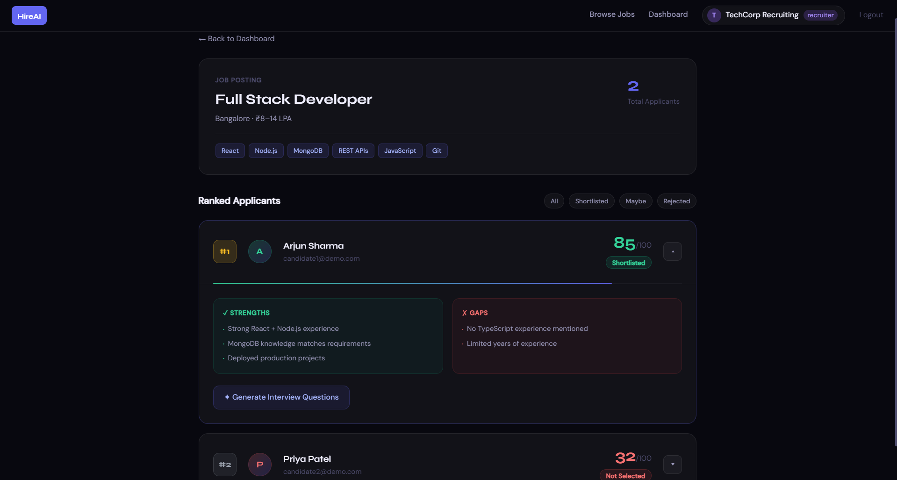

# HireAI — AI-Powered Hiring Assistant

[](https://smart-hiring-assistant.vercel.app)
[](https://github.com/yuvarajmn10/smart-hiring-assistant)
[](https://hireai-backend-eaks.onrender.com)

HireAI is a full-stack hiring platform. It uses Google Gemini to score each
resume against the job's requirements. Recruiters see applicants ranked by
their AI fit score and can move them to interview, selected or rejected in a
click. Candidates build or upload a resume, check their fit before applying,
and follow their application status from their dashboard.

---

## 🎬 Demo

[](https://smart-hiring-assistant.vercel.app)

**Live App:** https://smart-hiring-assistant.vercel.app
**Backend API:** https://hireai-backend-eaks.onrender.com

> The backend runs on Render's free tier and sleeps when idle. The first request after a pause can take about 50 seconds.

| Role | Email | Password |
|------|-------|----------|
| Recruiter | recruiter@demo.com | demo1234 |
| Candidate (strong profile) | candidate1@demo.com | demo1234 |
| Candidate (fresher) | candidate2@demo.com | demo1234 |

---

## ✦ Features

### For recruiters
- **Post and manage jobs:** create postings with title, description, requirements, location and salary, and delete them when they're filled.
- **AI-ranked applicants:** each applicant gets a fit score (0–100), a verdict (Shortlisted 80+, Maybe 50–79, Not Selected below 50), strengths and skill gaps.
- **Max-heap ranking:** applicants are ordered with a custom JavaScript max-heap instead of a full sort.
- **Hiring decisions:** move each applicant from **Under Review** to **Interview**, **Selected** or **Rejected**.
- **Top-N bulk action:** apply one status to the top N ranked candidates at once. For example, "Mark top 3 as Selected".
- **Targeted interview questions:** AI writes 5 questions per candidate aimed at that candidate's weak areas.
- **Re-score:** if the AI was unavailable when someone applied, score the application later with one click.

### For candidates
- **Resume profile:** fill in a resume form (skills, experience, education, projects) or upload a PDF. It is saved once and reused for every application.
- **Fit check before applying:** preview your AI score and verdict for a job before you submit.
- **AI cover letter:** generate a cover letter tailored to the job from your resume.
- **Live jobs from other sites:** browse real openings pulled from Google Jobs through the JSearch API.
- **Application tracker:** one dashboard covers HireAI applications, with the recruiter's decision, and applications on other sites, where you update the status yourself.

### Platform
- **Role-based access:** JWT auth with recruiter and candidate roles, protected routes, and ownership checks on every write.
- **Forgot password:** a 6-digit reset code by email (Gmail app password). If email isn't configured, the code is printed to the server terminal.
- **Resilient AI:** requests go to several Gemini models in turn, with retries and quota cool-downs, so scoring keeps working on the free tier.
- **Themes and mobile layout:** a theme picker and a responsive layout on every page.

---

## 🛠 Tech Stack

| Layer | Technology |
|-------|-----------|
| Frontend | React 19, Vite, React Router, Axios |
| Backend | Node.js, Express 5 |
| Database | MongoDB Atlas + Mongoose |
| AI | Google Gemini (`@google/generative-ai`, JSON-mode responses, multi-model fallback) |
| Auth | JWT + bcryptjs |
| File upload | multer (memory storage) + pdf-parse |
| External jobs | JSearch API (RapidAPI) |
| Email | Nodemailer (Gmail) |
| Deploy | Vercel (frontend) · Render (backend) |

---

## 🏗 Architecture

```
Browser (Vercel)           Backend (Render)                Services
────────────────           ─────────────────              ────────
React + Vite     ──────▶   Express REST API     ──────▶   MongoDB Atlas
JWT in storage             JWT auth + role checks  ──▶    Google Gemini
                           multer + pdf-parse      ──▶    JSearch (RapidAPI)
                           Max-heap ranking        ──▶    Gmail (Nodemailer)
```

**AI scoring flow**

```
Resume (form or PDF) → text extracted with pdf-parse
   → prompt built from job title + description + requirements + resume text
   → Gemini returns JSON { fitScore, verdict, strengths, weaknesses }
   → validated and saved to MongoDB → ranked with the max-heap
```

---

## 📁 Project Structure

```
smart-hiring-assistant/
├── backend/
│   ├── config/        # MongoDB connection, Gemini models
│   ├── controllers/   # Route handlers
│   ├── middleware/    # JWT protect, multer upload
│   ├── models/        # User, Job, Application, Resume, ExternalApplication
│   ├── routes/        # Express routers
│   ├── services/      # AI scorer, mailer
│   ├── utils/         # MaxHeap
│   ├── seed.js        # Demo users, jobs and applications
│   └── server.js
└── frontend/
    └── src/
        ├── api/        # Axios instance (adds the JWT)
        ├── components/ # Navbar, LiveJobs, Toast, ProtectedRoute, …
        ├── context/    # Auth and theme
        └── pages/      # Jobs, Dashboard, JobDetail, Apply, Resume, Auth pages
```

---

## 📡 API Routes

All routes are prefixed with `/api`. ✓ = requires a JWT.

**Auth**

| Method | Route | Auth | Description |
|--------|-------|------|-------------|
| POST | /auth/register | — | Register (recruiter or candidate) |
| POST | /auth/login | — | Log in and receive a JWT |
| POST | /auth/forgot-password | — | Email a reset code |
| POST | /auth/reset-password | — | Reset the password with the code |
| GET | /auth/me | ✓ | Current user |

**Jobs**

| Method | Route | Auth | Description |
|--------|-------|------|-------------|
| GET | /jobs | — | All open jobs |
| GET | /jobs/:id | — | Single job |
| GET | /jobs/my | ✓ | The logged-in recruiter's postings |
| POST | /jobs | Recruiter | Create a job |
| DELETE | /jobs/:id | Recruiter | Delete a job |

**Applications**

| Method | Route | Auth | Description |
|--------|-------|------|-------------|
| POST | /applications/preview | Candidate | Fit score only, nothing saved |
| POST | /applications/cover-letter | Candidate | AI-drafted cover letter |
| POST | /applications | Candidate | Apply (AI scores it on submit) |
| GET | /applications/my | Candidate | The candidate's applications |
| GET | /applications?jobId= | Recruiter | Applications for a job |
| GET | /applications/ranked?jobId=&k= | Recruiter | Top K, heap-ranked |
| POST | /applications/:id/rescore | Recruiter | Re-run AI scoring |
| PATCH | /applications/:id/status | Recruiter | Set applied / interview / selected / rejected |
| PATCH | /applications/status | Recruiter | Bulk status update (top N) |

**Resume, interview and external jobs**

| Method | Route | Auth | Description |
|--------|-------|------|-------------|
| GET | /profile/resume | ✓ | Saved resume profile |
| PUT | /profile/resume | ✓ | Save the resume form |
| POST | /profile/resume/upload | ✓ | Upload a resume PDF |
| DELETE | /profile/resume | ✓ | Delete the saved resume |
| POST | /resume/parse | ✓ | Extract text from a PDF |
| GET | /interview/:applicationId | Recruiter | Generate interview questions |
| GET | /external-jobs | — | Live jobs from JSearch |
| POST | /external-applications | ✓ | Track an application on another site |
| GET | /external-applications/my | ✓ | Tracked external applications |
| PATCH | /external-applications/:id | ✓ | Update its status |
| DELETE | /external-applications/:id | ✓ | Remove it |

---

## 🚀 Run Locally

**Prerequisites:** Node.js 18+, a MongoDB Atlas cluster and a Gemini API key.
A RapidAPI key (for live jobs) and a Gmail app password (for reset emails) are optional.

### 1. Clone

```bash
git clone https://github.com/yuvarajmn10/smart-hiring-assistant.git
cd smart-hiring-assistant
```

### 2. Backend

```bash
cd backend
npm install
```

Create `backend/.env`:

```env
PORT=5000
MONGO_URI=your_mongodb_atlas_uri
JWT_SECRET=your_jwt_secret
GEMINI_API_KEY=your_gemini_key
FRONTEND_URL=http://localhost:5173

# Optional
RAPIDAPI_KEY=your_rapidapi_key        # live jobs from other sites
EMAIL_USER=you@gmail.com              # password reset emails
EMAIL_PASS=your_gmail_app_password
```

```bash
npm run seed   # optional: loads the demo users, jobs and applications
npm run dev    # http://localhost:5000
```

### 3. Frontend

In a second terminal:

```bash
cd frontend
npm install
```

Create `frontend/.env`:

```env
VITE_API_URL=http://localhost:5000/api
```

```bash
npm run dev    # http://localhost:5173
```

Open http://localhost:5173 and log in with one of the demo accounts above.

---

## 💡 Technical Highlights

**Max-heap ranking.** Candidates are ranked with a custom max-heap instead of
a plain `.sort()`. When a recruiter only needs the top K of N applicants, this
costs O(n + k log n) rather than sorting everything.

**Structured AI output.** Gemini runs in JSON mode. The prompt passes the job
title, description, requirements and resume text as separate fields. The
response is validated before saving, and there is a safe fallback if parsing
fails.

**AI fallback chain.** Each Gemini free-tier model has a small daily quota.
Calls go through several models in order. Models that hit their quota rest for
10 minutes, and overload or time-out errors are retried, so the app keeps
scoring when one model is exhausted.

**Security.** Passwords are hashed with bcrypt (10 salt rounds), and JWTs
expire after 7 days. Reset codes are stored hashed and rate-limited. Every
write checks ownership, for example that recruiters only change applications
for their own jobs. Role guards run on both the frontend routes and the
backend controllers.

---

## ☁️ Deployment

| Part | Host | Setup |
|------|------|-------|
| Backend | Render | `render.yaml` Blueprint: root `backend`, `npm install`, `npm start`. Set the secrets from `.env` in the Render dashboard, and set `FRONTEND_URL` to the Vercel URL. |
| Frontend | Vercel | Root directory `frontend`, Vite preset, with `VITE_API_URL=https://<render-url>/api`. |
| Database | MongoDB Atlas | Allow access from `0.0.0.0/0`, because Render's IP addresses change. |

Every push to `main` redeploys both sites.

---

## 👤 Author

**Yuvaraj M N**
GitHub: [@yuvarajmn10](https://github.com/yuvarajmn10)

---

## 📄 License

MIT © Yuvaraj M N
